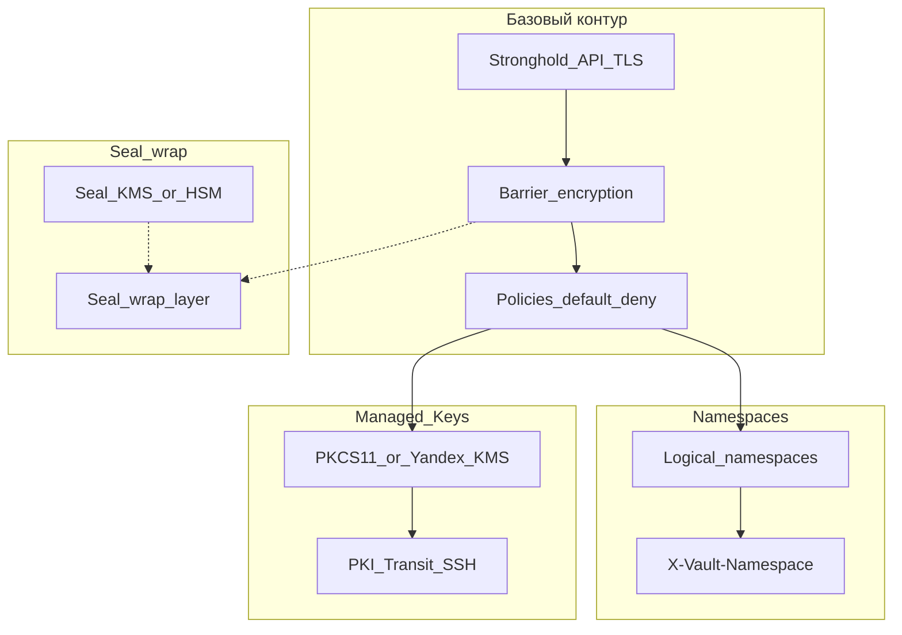

[MITRE D3FEND](https://d3fend.mitre.org/) — база знаний **контрмер** (защитных техник), сгруппированных по тактикам: Model, Harden, Detect, Isolate, Deceive, Evict, Restore. В отличие от матрицы детекции EDR, Deckhouse Stronghold — **инфраструктурный контроль доступа и жизненного цикла секретов**: он не заменяет антивирус и не детектирует техники вроде T1059 по хосту, но **снижает реализуемость** техник кражи учётных данных, злоупотребления долгоживущими секретами и пересечения доверенных контуров.

### D3FEND для технической аудитории и аудита

Для **аудита и архитектуры** D3FEND задаёт **именованные контрмеры**. Stronghold следует трактовать не только как хранилище «ключ–значение», а как **систему реализации набора согласованных контрмер** (см. таблицы ниже): прежде всего **Harden** и **Isolate**, затем **Evict**, **Restore**; **Detect** — в основном через журналы для внешних средств; **Model** — слабо в ядре, частично при **[GitOps-плагине](#gitops-plugin)**; **Deceive** в базовом продукте почти не задействована.

## Покрытие тактик D3FEND (все семь)

Оценка — по смыслу [таксономии D3FEND](https://d3fend.mitre.org/) и возможностям Vault-совместимого ядра Stronghold (политики, токены, lease, аудит, namespaces, seal wrap, Managed Keys, квоты и т.д.).

| Тактика D3FEND | Оценка для Stronghold | Кратко |
|----------------|----------------------|--------|
| **Harden** | **Высокая** | Криптография (TLS, barrier, seal wrap), аутентификация (в т.ч. [MFA](https://deckhouse.ru/products/stronghold/documentation/user/auth/mfa/), [WebAuthn](https://deckhouse.ru/products/stronghold/documentation/user/auth/webauthn/) / FIDO2 и passkeys, безпарольный вход в UI), динамические секреты, Managed Keys (`pkcs11`, `yandexcloudkms`). |
| **Isolate** | **Средняя–высокая** | ACL, default deny, [namespaces](https://deckhouse.ru/products/stronghold/documentation/admin/namespaces/overview/), квоты с **rate limit** на API (ограничение частоты запросов по пути/монтированию/пространству имён). |
| **Evict** | **Высокая** | Отзыв токенов и lease, истечение TTL, **user lockout** при многократных ошибках входа (настраиваемо на auth-методах). |
| **Restore** | **Средняя–высокая** | Повторная выдача динамических учётных данных и сертификатов (**Reissue Credential**); восстановление кластера из **снимков Raft** ([автоснимки](https://deckhouse.ru/products/stronghold/documentation/admin/backups/automated-snapshots/), ручной [снимок](https://deckhouse.ru/products/stronghold/documentation/admin/backups/save/)); настройка политики бэкапов через **API с `sudo`**. |
| **Detect** | **Низкая** | Не EDR: **аудит** ([обзор](https://deckhouse.ru/products/stronghold/documentation/admin/audit/overview/)) даёт события для SIEM; пороги и корреляции строятся **вне** Stronghold. |
| **Model** | **Низкая–средняя** | В ядре нет CMDB; при **[GitOps-плагине](#gitops-plugin)** — декларативная конфигурация в Git и версионируемое «намеренное состояние» (см. [Configuration Inventory](https://d3fend.mitre.org/technique/d3f:ConfigurationInventory)). |
| **Deceive** | **Практически нет** | Встроенных приманок/decoy для секретов в ядре нет. |

Детальная таблица «возможность Stronghold → техника D3FEND» приведена ниже; её можно приложить к отчёту аудита. Сопоставление **не** является сертификацией MITRE.

## Основная таблица: тактика D3FEND — техника — роль Stronghold

Идентификаторы техник приведены в нотации MITRE D3FEND (см. [матрицу D3FEND](https://d3fend.mitre.org/)).

| Тактика D3FEND | Техника (ID) | Как Stronghold вносит вклад |
|----------------|--------------|-----------------------------|
| **Model** | [Configuration Inventory](https://d3fend.mitre.org/technique/d3f:ConfigurationInventory) (**D3-CI**) | При подключённом **[GitOps-плагине](#gitops-plugin)** ([vault-plugin-gitops](https://github.com/trublast/vault-plugin-gitops)): декларативное описание конфигурации (YAML или Terraform), мониторинг репозитория, состояние в хранилище — **согласованный срез** желаемой настройки и история изменений в Git; это **не** полноценная инвентаризация активов и **не** автоматическое обнаружение конфигурации на хостах. |
| **Harden** | [Application Configuration Hardening](https://d3fend.mitre.org/technique/d3f:ApplicationConfigurationHardening) (**D3-ACH**) | Тот же сценарий GitOps: применение после коммитов с **подписями** (число проверенных подписей настраивается), доверенные PGP-ключи в конфигурации плагина ([README](https://github.com/trublast/vault-plugin-gitops/blob/main/README.md)); усиливает целостность и предсказуемость изменений по сравнению с нерегламентированными ручными вызовами API (при защищённом Git, токене плагина и код-ревью). |
| **Harden** | [Credential Hardening](https://d3fend.mitre.org/technique/d3f:CredentialHardening) (**D3-CH**): в т.ч. Certificate Rotation, Password Rotation | Динамические учётные данные (движки БД и др.), PKI/Transit/SSH, ограничение времени жизни токенов и lease, ротация материала по политикам; при **Managed Keys** — ключевой материал во внешнем backend-е (**`pkcs11`** / HSM или **`yandexcloudkms`**). |
| **Harden** | [Message Encryption](https://d3fend.mitre.org/technique/d3f:MessageEncryption) | TLS для клиентского API и межузлового трафика; шифрование на барьере перед записью в storage. |
| **Harden** | [File Encryption](https://d3fend.mitre.org/technique/d3f:FileEncryption) | Криптографический **barrier**: данные на носителе хранилища в виде шифротекста. |
| **Harden** | [Token-based Authentication](https://d3fend.mitre.org/technique/d3f:Token-basedAuthentication) | Токены клиента на каждый запрос (кроме сценариев входа); связка с методами аутентификации (Kubernetes, JWT, LDAP, AppRole и др.). |
| **Harden** | [Certificate-based Authentication](https://d3fend.mitre.org/technique/d3f:Certificate-basedAuthentication) | Клиентские и межузловые сертификаты там, где это настроено в развёртывании. |
| **Harden** | [Multi-factor Authentication](https://d3fend.mitre.org/technique/d3f:Multi-factorAuthentication) | Второй фактор при входе: [MFA в Stronghold](https://deckhouse.ru/products/stronghold/documentation/user/auth/mfa/) — в т.ч. [TOTP](https://deckhouse.ru/products/stronghold/documentation/user/auth/mfa/totp/) (`identity/mfa`, login enforcement на методах auth), [метод WebAuthn](https://deckhouse.ru/products/stronghold/documentation/user/auth/webauthn/) — **FIDO2**-совместимые аутентификаторы и **passkeys**, в т.ч. **безпарольный** вход в веб-интерфейс и сценарии с HTTP API; опционально [Multifactor LDAP Adapter](https://deckhouse.ru/products/stronghold/documentation/user/auth/mfa/multifactor/). |
| **Isolate** | [Credential Transmission Scoping](https://d3fend.mitre.org/technique/d3f:CredentialTransmissionScoping) (**D3-CTS**) | Политики ACL по путям; **namespaces** — логическое ограничение областей токенов и монтирования (см. ниже). |
| **Isolate** | [Access Mediation](https://d3fend.mitre.org/technique/d3f:AccessMediation) | Стратегия default deny; явные разрешения в политиках; административные границы пространств имён; для конфигурации [автоснимков Raft](#raft-snapshots-api) — только субъекты с правами **`sudo`**. |
| **Isolate** | Ограничение частоты запросов (resource quotas / **rate limit**) | Квоты на частоту обращений к HTTP API (в т.ч. по namespace, mount, пути, роли на auth) — снижение риска перегрузки и массового перебора; отказ при превышении лимита фиксируется в [аудите](https://deckhouse.ru/products/stronghold/documentation/admin/audit/overview/). |
| **Detect** | [Authentication Event Thresholding](https://d3fend.mitre.org/technique/d3f:AuthenticationEventThresholding) / [Authorization Event Thresholding](https://d3fend.mitre.org/technique/d3f:AuthorizationEventThresholding) | При включённом **аудите** — запись событий аутентификации и авторизации для последующего анализа в SIEM; **пороговые правила и алерты** на стороне потребителя логов, не встроенная аналитика Stronghold. |
| **Evict** | [Credential Revocation](https://d3fend.mitre.org/technique/d3f:CredentialRevocation) (**D3-CR**) | Отзыв токенов и аренды (leases), истечение срока жизни секретов. |
| **Evict** | [Session Termination](https://d3fend.mitre.org/technique/d3f:SessionTermination) | Прекращение действия токена по TTL или отзыву; невалидный токен не проходит запрос. |
| **Evict** | [Account Locking](https://d3fend.mitre.org/technique/d3f:AccountLocking) | **User lockout:** временная блокировка проверки учётных данных при многократных ошибках входа (настройка per auth method / сервера). |
| **Restore** | [Reissue Credential](https://d3fend.mitre.org/technique/d3f:ReissueCredential) (**D3-RIC**) | Повторная выдача динамических учётных данных и сертификатов после истечения или отзыва. |
| **Restore** | [Restore User Account Access](https://d3fend.mitre.org/technique/d3f:RestoreUserAccountAccess) (частично) | Снятие **user lockout** и восстановление легитимного доступа через операторский контур / API, где это предусмотрено конфигурацией. |
| **Restore** | [Restore File](https://d3fend.mitre.org/technique/d3f:RestoreFile) (**D3-RF**), в таксономии — под [Restore Object](https://d3fend.mitre.org/technique/d3f:RestoreObject) | Файлы снимков состояния Raft (локально или в объектном хранилище) используются для [восстановления](https://deckhouse.ru/products/stronghold/documentation/admin/backups/restore/) после сбоев и инцидентов; регулярные копии и политика `retain` задаются [автоснимками](https://deckhouse.ru/products/stronghold/documentation/admin/backups/automated-snapshots/). |

## Выделенно: автоматические снимки Raft и управление через API

При **интегрированном Raft-хранилище** [автоматические снимки](https://deckhouse.ru/products/stronghold/documentation/admin/backups/automated-snapshots/) создаются самим Stronghold по расписанию; конфигурации задаются через API (`sys/storage/raft/snapshot-auto/config/...`), для записи требуются права **`sudo`**.

| Связь с D3FEND / ATT&CK | Содержание |
|-------------------------|------------|
| **Restore → Restore File (D3-RF)** | Наличие предсказуемых снимков и процедуры [восстановления](https://deckhouse.ru/products/stronghold/documentation/admin/backups/restore/) реализует класс контрмер «восстановление объекта из резервной копии» в терминах D3FEND. |
| **Isolate → Access Mediation** | Управление политикой бэкапов **не** сводится к произвольному cron на узле: изменение расписания, целевого бакета/префикса и параметров S3 проходит через контролируемый API и полномочия Stronghold; при включённом [аудите](https://deckhouse.ru/products/stronghold/documentation/admin/audit/overview/) — учёт административных операций. |
| **Impact → [T1490](https://attack.mitre.org/techniques/T1490/) Inhibit System Recovery** (снижение риска) | Злоумышленник может пытаться уничтожить или подменить резервные копии. Вынесение снимков **за пределы** узла кластера (рекомендуемый **S3**-режим в документации), **иммутабельность** и права на бакет на стороне объектного хранилища — вне ядра Stronghold; со стороны продукта — регулярные снимки и **ограничение круга субъектов**, которые могут отключить или переопределить политику (права **`sudo`**, [аудит](https://deckhouse.ru/products/stronghold/documentation/admin/audit/overview/)). |

**Не путать** с резервным копированием **внешних** backend-ов (`etcd`, `postgresql` и т.д.): для них нужны отдельные процедуры средствами самого хранилища, как указано в документации по автоснимкам.

## Выделенно: Seal wrap (двойное шифрование) и KMS/HSM

Механизм [seal wrap](https://deckhouse.ru/products/stronghold/documentation/admin/kms-hsm/sealwrap/) добавляет **второй слой** шифрования чувствительных значений поверх barrier за счёт используемого механизма `seal` (в т.ч. при связке с [KMS/HSM](https://deckhouse.ru/products/stronghold/documentation/admin/kms-hsm/)).

| Связь с D3FEND | Содержание |
|----------------|------------|
| **Harden → Message Encryption / File Encryption** | Дополнительная обёртка для критичных параметров и части данных движков; усиливает защиту «на диске» и привязку к внешнему корню доверия (`seal`). |
| **Harden → Platform Hardening** (в широком смысле) | Использование аппаратного или облачного KMS/HSM как части модели доверия для `seal` — вместе с корректной эксплуатацией внешней системы. |
| Операции жизненного цикла | Смена `seal` или ключей во внешнем KMS требует контролируемого **rewrap** ([API `sys/sealwrap/rewrap`](https://deckhouse.ru/products/stronghold/documentation/admin/kms-hsm/sealwrap/)); это сопоставимо с организационно-техническим управлением криптографическим материалом, а не с отдельным ID «Detect». |

**Не путать** с [Managed Keys](#managed-keys-stronghold): seal wrap защищает **хранимые** записи через `seal`, а Managed Keys относятся к **криптографическим операциям** (PKI, Transit, SSH и др.) с делегированием во внешний backend (**`pkcs11`**, **`yandexcloudkms`**) без экспорта закрытого ключа в Stronghold.

## Выделенно: пространства имён (namespaces)

[Пространства имён](https://deckhouse.ru/products/stronghold/documentation/admin/namespaces/overview/) задают изолированные политики, монтирования, методы auth и токены в иерархии с корнем `root`.

| Связь с D3FEND | Содержание |
|----------------|------------|
| **Isolate → Access Mediation** | Разделение административных и пользовательских контуров на уровне логики API (`X-Vault-Namespace` / CLI). |
| **Isolate → Credential Transmission Scoping (D3-CTS)** | Ограничение «охвата» токенов и политик выбранным пространством имён и дочерними областями. |

Namespaces **не** заменяют сетевую сегментацию L3; они уменьшают риск пересечения политик и ошибочного доступа между командами на уровне одного сервера Stronghold.

## Выделенно: Managed Keys (PKI, Transit, SSH)

**Managed Keys** — общая абстракция: движки секретов используют зарегистрированные записи `sys/managed-keys/<type>/<name>` и **делегируют операции** внешнему backend-у. В Stronghold поддерживаются типы **`pkcs11`** (HSM, PKCS#11) и **`yandexcloudkms`** (Yandex Cloud KMS); закрытый ключ не хранится в Stronghold как экспортируемый материал. Движки **PKI**, **Transit** и **SSH** подключаются к managed keys согласно [документации Deckhouse Stronghold](https://deckhouse.ru/products/stronghold/documentation/user/managed-keys/overview/).

| Связь с D3FEND | Содержание |
|----------------|------------|
| **Harden → Credential Hardening (D3-CH)** (в т.ч. Certificate Rotation) | PKI и SSH: подпись с ключом во внешнем HSM или в Yandex Cloud KMS; снижение риска кражи «файлового» ключа CA с хоста Stronghold. |
| **Harden → Credential Hardening / Message Authentication** | Transit: криптопримитивы с ключом во внешнем backend-е (набор операций зависит от типа ключа и политики). |
| **Harden → Platform Hardening** | Для **`pkcs11`**: защита ключа в HSM, PIN и среда библиотеки. Для **`yandexcloudkms`**: доверие к облачному KMS и корректность учётных данных доступа. |

Зависимость от корректности внешних backend-ов — см. [модель угроз](threat-model.ru.html).

## Выделенно: GitOps-плагин (vault-plugin-gitops)

В Deckhouse Stronghold может использоваться плагин **[vault-plugin-gitops](https://github.com/trublast/vault-plugin-gitops)** — мониторинг Git-репозитория и применение конфигурации после коммитов с **достаточным числом проверенных подписей** ([описание и параметры](https://github.com/trublast/vault-plugin-gitops/blob/main/README.md)). **Допущение оценки в этом документе:** подписи **проверяются** относительно ключей, заданных в Stronghold, и требуется **несколько** независимых подписей (параметр вроде `required_number_of_verified_signatures_on_commit` > 1); тогда **произвольная запись в репозиторий без набора валидных подписей не приводит** к применению конфигурации в Stronghold. Формат — YAML или Terraform; состояние хранится в Stronghold; доступ плагина к API — по настроенному токену.

| Связь с D3FEND | Содержание |
|----------------|------------|
| **Model → Configuration Inventory (D3-CI)** | Репозиторий задаёт **декларативный** эталон конфигурации и историю; это ближе к учёту «как должно быть настроено», чем к классической **Asset Inventory** / **Network Mapping** в D3FEND. |
| **Harden → Application Configuration Hardening (D3-ACH)** | Подписи коммитов и доверенные ключи снижают риск **непрошедших согласование** изменений по сравнению с прямой правкой через CLI/API без процесса. |
| **Detect** (косвенно) | История Git и подписи облегчают **расследование** «кто и когда авторизовал изменение»; корреляции и алерты остаются на стороне Git-платформы, SIEM и процессов. |

Оценка контрмер относится к **архитектуре решения** при осознанном развёртывании. При допущении выше **остаточные** риски в первую очередь: **компрометация одного или нескольких закрытых ключей** из числа доверенных (или insider с правом подписи), **подмена списка доверенных ключей / параметров подписи** через уже скомпрометированный Stronghold, **токена плагина** с избыточными полномочиями. Одна лишь компрометация учётной записи Git с правом push **без** кражи достаточного набора ключей подписи не даёт гарантированного сценария «залить произвольный конфиг».

## Сжатая связка с MITRE ATT&CK

Техники [MITRE ATT&CK (Enterprise)](https://attack.mitre.org/matrices/enterprise/) ниже иллюстрируют **снижение риска** со стороны централизованного управления секретами и ключами, а не детекцию на хосте и не блокировку сетевых атак. Названия тактик и техник приведены по данным MITRE (актуальная матрица на момент подготовки документа).

**Резервное копирование состояния Raft** ([автоснимки](https://deckhouse.ru/products/stronghold/documentation/admin/backups/automated-snapshots/), раздел [выше](#raft-snapshots-api)) в первую очередь связывают оборону с тактикой **Impact** (восстановление после разрушения данных или вымогательского шифрования) и с контрмерой к саботажу восстановления; в таблице — строка **T1490** и уточнение к **T1485**.

**Многофакторная аутентификация** усиливает защиту входа в Stronghold и косвенно снижает сценарии с одним украденным паролем; подробности — в [разделе 2FA / MFA](https://deckhouse.ru/products/stronghold/documentation/user/auth/mfa/) ([TOTP](https://deckhouse.ru/products/stronghold/documentation/user/auth/mfa/totp/), [Multifactor LDAP](https://deckhouse.ru/products/stronghold/documentation/user/auth/mfa/multifactor/)). Отдельно [метод WebAuthn](https://deckhouse.ru/products/stronghold/documentation/user/auth/webauthn/) опирается на **FIDO2** и **passkeys** и подходит для **безпарольного** входа в UI и интеграций по HTTP API (см. документацию по эндпоинтам `login`/`register`). В таблице это отражено прежде всего в строках **T1110** и **T1078**.

| Тактика ATT&CK | Техника ATT&CK | Роль Stronghold (обобщённо) |
|----------------|----------------|----------------------------|
| [TA0006](https://attack.mitre.org/tactics/TA0006/) Credential Access | [T1552](https://attack.mitre.org/techniques/T1552/) Unsecured Credentials | Убирает хранение «голых» секретов в конфигурации, коде и общих файлах: материал запрашивается по политикам, с TTL и аудитом. |
| [TA0006](https://attack.mitre.org/tactics/TA0006/) Credential Access | [T1555](https://attack.mitre.org/techniques/T1555/) Credentials from Password Stores | Секреты в хранилище за barrier и ACL; динамические пароли; **Managed Keys** уменьшает риск кражи долгоживущего ключа подписи с узла (**`pkcs11`**, **`yandexcloudkms`**). |
| [TA0006](https://attack.mitre.org/tactics/TA0006/) Credential Access | [T1528](https://attack.mitre.org/techniques/T1528/) Steal Application Access Token | Краткоживущие токены Stronghold и lease, отзыв; ограничение области политиками и namespaces снижает окно и охват компрометации. |
| [TA0006](https://attack.mitre.org/tactics/TA0006/) Credential Access | [T1558](https://attack.mitre.org/techniques/T1558/) Steal or Forge Kerberos Tickets | Риск смягчается за счёт централизованного управления сертификатами/ключами (PKI и др.) и ротации, а не хранения материала на конечных хостах. |
| [TA0006](https://attack.mitre.org/tactics/TA0006/) Credential Access | [T1110](https://attack.mitre.org/techniques/T1110/) Brute Force | **User lockout** и **rate limit** на API снижают массовый перебор пароля; при включённом **[MFA](https://deckhouse.ru/products/stronghold/documentation/user/auth/mfa/)** (например [TOTP](https://deckhouse.ru/products/stronghold/documentation/user/auth/mfa/totp/) с login enforcement) одного угаданного пароля недостаточно для получения рабочего токена до прохождения второго фактора. Для входа только через **[WebAuthn](https://deckhouse.ru/products/stronghold/documentation/user/auth/webauthn/)** (FIDO2 / passkeys, в т.ч. безпарольный) классический перебор пароля к учётной записи неприменим. |
| [TA0042](https://attack.mitre.org/tactics/TA0042/) Resource Development | [T1588](https://attack.mitre.org/techniques/T1588/) Obtain Capabilities | Сложнее похитить «готовый» материал для подписи/доверия, если код-подпись и PKI завязаны на Stronghold, ACL и при необходимости **Managed Keys** (в т.ч. смысл подтехник вроде [T1588.003](https://attack.mitre.org/techniques/T1588/003/) Code Signing Certificates, [T1588.004](https://attack.mitre.org/techniques/T1588/004/) Digital Certificates). |
| [TA0004](https://attack.mitre.org/tactics/TA0004/) Privilege Escalation | [T1078](https://attack.mitre.org/techniques/T1078/) Valid Accounts | Временные учётные данные и токены, отзыв, политики по путям; компрометация долгоживущего секрета не обязана давать «вечный» доступ. При **[MFA](https://deckhouse.ru/products/stronghold/documentation/user/auth/mfa/)** компрометация только пароля (или одного фактора) не даёт полноценного доступа к API Stronghold до успешной проверки дополнительного фактора. При **безпарольном** входе через **[WebAuthn](https://deckhouse.ru/products/stronghold/documentation/user/auth/webauthn/)** (FIDO2) пароль как таковой для этого метода отсутствует; поверхность атаки смещается к компрометации токена Stronghold, устройства-аутентификатора или социальной инженерии, а не к краже статического пароля из конфигурации. |
| [TA0008](https://attack.mitre.org/tactics/TA0008/) Lateral Movement | [T1021](https://attack.mitre.org/techniques/T1021/) Remote Services | Разные секреты и политики для разных сервисов и контуров; динамические учётные данные для доступа к удалённым службам без общих паролей. |
| [TA0008](https://attack.mitre.org/tactics/TA0008/) Lateral Movement | [T1550](https://attack.mitre.org/techniques/T1550/) Use Alternate Authentication Material | Частично: выдача краткоживущих сервисных токенов и динамических секретов снижает ценность украденных долгоживущих материалов; не замена защите конечных систем (Pass-the-Hash и т.д.). |
| [TA0003](https://attack.mitre.org/tactics/TA0003/) Persistence | [T1136](https://attack.mitre.org/techniques/T1136/) Create Account | Регулярная ротация динамических паролей (например, к БД) может инвалидировать «лишние» учётные записи, созданные для закрепления, если политика ротации это обеспечивает. |
| [TA0040](https://attack.mitre.org/tactics/TA0040/) Impact | [T1485](https://attack.mitre.org/techniques/T1485/) Data Destruction | Строгие политики к путям с облачными/инфраструктурными ключами и секретами снижают риск несанкционированного получения полномочий на разрушительные действия. После инцидента восстановление данных Stronghold из **снимков Raft** (см. [восстановление](https://deckhouse.ru/products/stronghold/documentation/admin/backups/restore/)) уменьшает необратимые последствия для кластера при корректных внешних копиях и процедурах. |
| [TA0040](https://attack.mitre.org/tactics/TA0040/) Impact | [T1490](https://attack.mitre.org/techniques/T1490/) Inhibit System Recovery | Техника злоумышленника — помешать восстановлению (удалить бэкапы, сменить политику и т.п.). **Автоснимки** с выносом в объектное хранилище и настройкой только через API с **`sudo`** снижают риск «тихого» отключения политики посторонним процессом на хосте и поддерживают наличие копий вне узла; **защита бакета** (права, versioning, object lock) — на стороне S3-совместимого сервиса. |

Тактики **Initial Access**, **Execution**, **Defense Evasion** на уровне ОС Stronghold **не закрывает** — это другие слои защиты (патчи, EDR, сеть).

## Ограничения интерпретации

- D3FEND классифицирует **классы защитных мер**; перечисление техник рядом со Stronghold означает **вклад продукта** при осмысленной настройке и эксплуатации, а не формальную сертификацию MITRE.
- **Тактика Model** в ядре слабая (нет CMDB); при **[GitOps-плагине](#gitops-plugin)** возможен **частичный** вклад в духе **Configuration Inventory** — см. таблицу выше. **Deceive** в продукте почти не представлена: нет встроенных приманок для секретов.
- **Seal wrap** и внешние **`seal`**-backend-ы требуют доверия к KMS/HSM и к процедурам rewrap; при компрометации внешней системы модель ослабевает.
- **Аудит** обеспечивает данные для анализа; корреляция, пороговые алерты и детект-сценарии выполняются **внешними** средствами (SIEM и т.д.).
- Расширенные **квоты** (например, учёт по lease count) могут относиться к расширенным редакциям Vault-совместимого продукта; ориентируйтесь на фактически доступные в вашей сборке Stronghold API и документацию.
- **Автоснимки Raft** не отменяют необходимости защищать объектное хранилище и учётные данные к нему; при компрометации токена с `sudo` злоумышленник может менять конфигурацию бэкапов в пределах модели доверия Stronghold.
- **GitOps-плагин** — отдельный компонент с собственным жизненным циклом; при компрометации **токена** плагина или **административных путей** в Stronghold (список доверенных ключей, параметры подписи) модель ослабевает. Одна лишь компрометация **записи в Git** при соблюдении [допущения](#gitops-plugin) о нескольких подписях не отменяет проверку подписей.

## Схема: три усиливающих контура

На диаграмме показаны три характерных механизма Stronghold, дополняющих базовый barrier и политики (без претензии на полный поток данных).

## Ссылки

- [MITRE D3FEND](https://d3fend.mitre.org/)
- [Модель угроз Stronghold](threat-model.ru.html)
- [Управляемые ключи (Managed Keys)](https://deckhouse.ru/products/stronghold/documentation/user/managed-keys/overview/)
- [Двойное шифрование (seal wrap)](https://deckhouse.ru/products/stronghold/documentation/admin/kms-hsm/sealwrap/)
- [KMS и HSM](https://deckhouse.ru/products/stronghold/documentation/admin/kms-hsm/)
- [Пространства имён](https://deckhouse.ru/products/stronghold/documentation/admin/namespaces/overview/)
- [Автоматические снимки (бэкапы Raft)](https://deckhouse.ru/products/stronghold/documentation/admin/backups/automated-snapshots/)
- [vault-plugin-gitops](https://github.com/trublast/vault-plugin-gitops) (управление конфигурацией из Git, см. [README](https://github.com/trublast/vault-plugin-gitops/blob/main/README.md))
